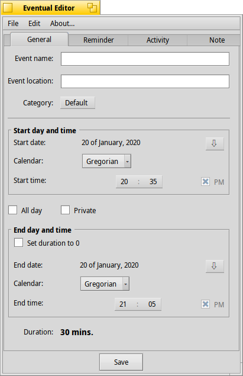

Eventual
=================
Personal time management system for Haiku. Intended to be a full-featured organizer.

Features:

•Event name 
•Event location 
•Add event category 
•Event time system 
•Reminder 
•Sound signal 
•Note 

LICENSE: MIT  
Original site: http://sourceforge.net/projects/eventual/
